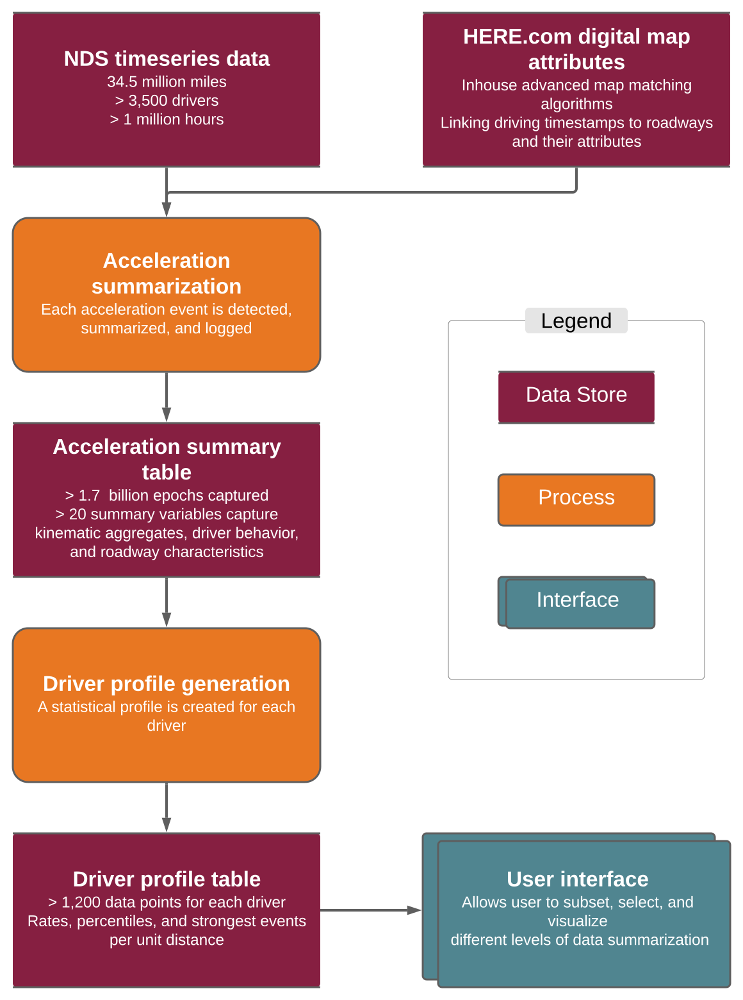
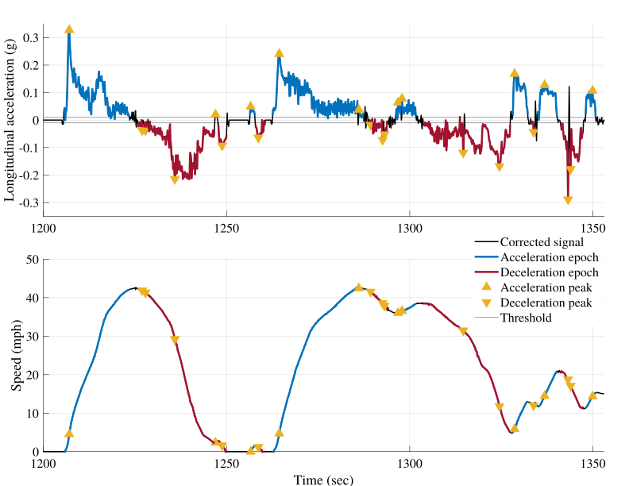

# The Surface Accelerations Reference - A Large-scale, Interactive Catalog of Passenger Vehicle Accelerations

## Accompanying Paper
The data and methods used to generate this dataset are described in a paper published in the IEEE Transactions on Intelligent Transportation Systems. The final published version of the paper can be access [here](https://ieeexplore.ieee.org/document/10108532) while the final accepted version can be found in this repository.

## Citation

If you use this dataset, please use the following citation:

G. Ali, S. McLaughlin and M. Ahmadian, "The Surface Accelerations Reference — A Large-Scale, Interactive Catalog of Passenger Vehicle Accelerations," in IEEE Transactions on Intelligent Transportation Systems, doi: 10.1109/TITS.2023.3267844.

```
@ARTICLE{ali_surface_2023,
  author={Ali, Gibran and McLaughlin, Shane and Ahmadian, Mehdi},
  journal={IEEE Transactions on Intelligent Transportation Systems}, 
  title={The Surface Accelerations Reference— A Large-Scale, Interactive Catalog of Passenger Vehicle Accelerations}, 
  year={2023},
  volume={},
  number={},
  pages={1-10},
  doi={10.1109/TITS.2023.3267844}}
  
```


## Introduction

The Surface Accelerations Reference is a catalog of all longitudinal and lateral accelerations experienced by SHRP2-NDS participants.
The Strategic Highway Research Program Naturalistic Driving Study (SHRP2-NDS) is the largest naturalistic driving study in the world constituting of 34.5 million miles of recorded driving data. To create the surface accelerations reference, each and every acceleration event in SHRP2-NDS was detected, summarized, and recorded creating a database of more than 1.7 billion data points. These data points were condensed to create a driving profile for each participant with signature kinematic measures within each roadway classification. The plots on the tool page compare such signature measures of SHRP2-NDS participants. 


## Methodology

Figure 1 shows the data flow diagram for the accelerations reference. Timeseries data from the SHRP2 NDS was first augmented with roadway attributes using HERE.com digital map data through in house map matching algorithms. This augmented timeseries data was then analyzed using the acceleration summarization algorithm illustrated in Figure 2.


<!--
</br>
<figure>

<figcaption>Figure 1 - Data flow diagram for the accelerations reference.</figcaption>
</figure>
</br>
-->

The acceleration summarization algorithm extracts, summarizes, and logs each acceleration event into the acceleration summary table. This is an intermediate table between the timeseries between the raw timeseries data and the final driver profiles.


<!--
</br>
<figure>

<figcaption>Figure 2 - Extracting accelerations and decelerations periods from IMU and speed timeseries data.</figcaption>
</figure>
</br>
-->

The driver profile generation process aggregates all the acceleration events and creates an individual profile for each driver with the measures for percentiles, rates, and strongest acceleration events in unit distance. These acceleration profiles form the back end dataset of this interactive analysis tool. The selections on the tool are processed to subset the dataset and generate the appropriate visualizations.


## Variable Definitions

<div class="tg-wrap"><table class="tg">
<thead>
  <tr>
    <th class="tg-dogz">Variable Name</th>
    <th class="tg-dogz">Variable Definition</th>
  </tr>
</thead>
<tbody>
  <tr>
    <td class="tg-alz1">Location_Code</td>
    <td class="tg-alz1">The location of the collection site at which the participant's vehicle was instrumented. The variable strongly correlates with the actual location of the driving but doesn't necessarily mean that all the driving by the participant happened in this location</td>
  </tr>
  <tr>
    <td class="tg-0lax">CONDITION_NUM</td>
    <td class="tg-0lax">Numerical code for the roadway condition. See Condition variable for more details.</td>
  </tr>
  <tr>
    <td class="tg-alz1">CONDITION</td>
    <td class="tg-alz1">Code for the roadway condition. There are two types of roadway conditions based on functional class and speed category. These roadway attributes have been derived from Here.com roadway attributes. See https://developer.here.com/documentation/routing/dev_guide/topics/resource-type-functional-class.html for functional class descriptions and https://developer.here.com/documentation/geocoder/dev_guide/topics/resource-type-speed-category.html for speed category descriptions. SC6-SC8 have been combined to create SC10</td>
  </tr>
  <tr>
    <td class="tg-0lax">Number of files</td>
    <td class="tg-0lax">This indicates the number of trips for the participant with valid data</td>
  </tr>
  <tr>
    <td class="tg-alz1">Vehicle_Year</td>
    <td class="tg-alz1">The vehicle model year</td>
  </tr>
  <tr>
    <td class="tg-0lax">50th percentile event (g)</td>
    <td class="tg-0lax">The value of the 50th percentile event in g. This corresponds to the strongest event in 2 events.</td>
  </tr>
  <tr>
    <td class="tg-alz1">60th percentile event (g)</td>
    <td class="tg-alz1">The value of the 60th percentile event in g</td>
  </tr>
  <tr>
    <td class="tg-0lax">70th percentile event (g)</td>
    <td class="tg-0lax">The value of the 70th percentile event in g</td>
  </tr>
  <tr>
    <td class="tg-alz1">75th percentile event (g)</td>
    <td class="tg-alz1">The value of the 75th percentile event in g</td>
  </tr>
  <tr>
    <td class="tg-0lax">80th percentile event (g)</td>
    <td class="tg-0lax">The value of the 80th percentile event in g</td>
  </tr>
  <tr>
    <td class="tg-alz1">90th percentile event (g)</td>
    <td class="tg-alz1">The value of the 90th percentile event in g</td>
  </tr>
  <tr>
    <td class="tg-0lax">95th percentile event (g)</td>
    <td class="tg-0lax">The value of the 95th percentile event in g</td>
  </tr>
  <tr>
    <td class="tg-alz1">99th percentile event (g)</td>
    <td class="tg-alz1">The value of the 99th percentile event in g</td>
  </tr>
  <tr>
    <td class="tg-0lax">99.9th percentile event (g)</td>
    <td class="tg-0lax">The value of the 99.9th percentile event in g. This corresponds to the strongest event in 1,000 events.</td>
  </tr>
  <tr>
    <td class="tg-alz1">Strongest event in 1 mile (g)</td>
    <td class="tg-alz1">The strongest event experienced on average once every mile</td>
  </tr>
  <tr>
    <td class="tg-0lax">Strongest event in 5 miles (g)</td>
    <td class="tg-0lax">The strongest event experienced on average once every 5 miles</td>
  </tr>
  <tr>
    <td class="tg-alz1">Strongest event in 10 miles (g)</td>
    <td class="tg-alz1">The strongest event experienced on average once every 10 miles</td>
  </tr>
  <tr>
    <td class="tg-0lax">Strongest event in 50 miles (g)</td>
    <td class="tg-0lax">The strongest event experienced on average once every 50 miles</td>
  </tr>
  <tr>
    <td class="tg-alz1">Strongest event in 100 miles (g)</td>
    <td class="tg-alz1">The strongest event experienced on average once every 100 miles</td>
  </tr>
  <tr>
    <td class="tg-0lax">Strongest event in 1000 miles (g)</td>
    <td class="tg-0lax">The strongest event experienced on average once every 1,000 miles</td>
  </tr>
  <tr>
    <td class="tg-alz1">Strongest event in 1 km (g)</td>
    <td class="tg-alz1">The strongest event experienced on average once every kilometer</td>
  </tr>
  <tr>
    <td class="tg-0lax">Strongest event in 5 km (g)</td>
    <td class="tg-0lax">The strongest event experienced on average once every 5 kilometer</td>
  </tr>
  <tr>
    <td class="tg-alz1">Strongest event in 10 km (g)</td>
    <td class="tg-alz1">The strongest event experienced on average once every 10 kilometer</td>
  </tr>
  <tr>
    <td class="tg-0lax">Strongest event in 50 km (g)</td>
    <td class="tg-0lax">The strongest event experienced on average once every 50 kilometer</td>
  </tr>
  <tr>
    <td class="tg-alz1">Strongest event in 100 km (g)</td>
    <td class="tg-alz1">The strongest event experienced on average once every 100 kilometer</td>
  </tr>
  <tr>
    <td class="tg-0lax">Strongest event in 1000 km (g)</td>
    <td class="tg-0lax">The strongest event experienced on average once every 1,000 kilometer</td>
  </tr>
  <tr>
    <td class="tg-alz1">Events stronger than 0.9 g per mile</td>
    <td class="tg-alz1">Average number of events experienced that were stronger than 0.9g per mile</td>
  </tr>
  <tr>
    <td class="tg-0lax">Events stronger than 0.8 g per mile</td>
    <td class="tg-0lax">Average number of events experienced that were stronger than 0.8g per mile</td>
  </tr>
  <tr>
    <td class="tg-alz1">Events stronger than 0.7 g per mile</td>
    <td class="tg-alz1">Average number of events experienced that were stronger than 0.7g per mile</td>
  </tr>
  <tr>
    <td class="tg-0lax">Events stronger than 0.6 g per mile</td>
    <td class="tg-0lax">Average number of events experienced that were stronger than 0.6g per mile</td>
  </tr>
  <tr>
    <td class="tg-alz1">Events stronger than 0.5 g per mile</td>
    <td class="tg-alz1">Average number of events experienced that were stronger than 0.5g per mile</td>
  </tr>
  <tr>
    <td class="tg-0lax">Events stronger than 0.4 g per mile</td>
    <td class="tg-0lax">Average number of events experienced that were stronger than 0.4g per mile</td>
  </tr>
  <tr>
    <td class="tg-alz1">Events stronger than 0.3 g per mile</td>
    <td class="tg-alz1">Average number of events experienced that were stronger than 0.3g per mile</td>
  </tr>
  <tr>
    <td class="tg-0lax">Events stronger than 0.2 g per mile</td>
    <td class="tg-0lax">Average number of events experienced that were stronger than 0.2g per mile</td>
  </tr>
  <tr>
    <td class="tg-alz1">Events stronger than 0.1 g per mile</td>
    <td class="tg-alz1">Average number of events experienced that were stronger than 0.1g per mile</td>
  </tr>
  <tr>
    <td class="tg-0lax">Events stronger than 0.9 g per km</td>
    <td class="tg-0lax">Average number of events experienced that were stronger than 0.9g per km</td>
  </tr>
  <tr>
    <td class="tg-alz1">Events stronger than 0.8 g per km</td>
    <td class="tg-alz1">Average number of events experienced that were stronger than 0.8g per km</td>
  </tr>
  <tr>
    <td class="tg-0lax">Events stronger than 0.7 g per km</td>
    <td class="tg-0lax">Average number of events experienced that were stronger than 0.7g per km</td>
  </tr>
  <tr>
    <td class="tg-alz1">Events stronger than 0.6 g per km</td>
    <td class="tg-alz1">Average number of events experienced that were stronger than 0.6g per km</td>
  </tr>
  <tr>
    <td class="tg-0lax">Events stronger than 0.5 g per km</td>
    <td class="tg-0lax">Average number of events experienced that were stronger than 0.5g per km</td>
  </tr>
  <tr>
    <td class="tg-alz1">Events stronger than 0.4 g per km</td>
    <td class="tg-alz1">Average number of events experienced that were stronger than 0.4g per km</td>
  </tr>
  <tr>
    <td class="tg-0lax">Events stronger than 0.3 g per km</td>
    <td class="tg-0lax">Average number of events experienced that were stronger than 0.3g per km</td>
  </tr>
  <tr>
    <td class="tg-alz1">Events stronger than 0.2 g per km</td>
    <td class="tg-alz1">Average number of events experienced that were stronger than 0.2g per km</td>
  </tr>
  <tr>
    <td class="tg-0lax">Events stronger than 0.1 g per km</td>
    <td class="tg-0lax">Average number of events experienced that were stronger than 0.1g per km</td>
  </tr>
  <tr>
    <td class="tg-alz1">Vehicle_Class</td>
    <td class="tg-alz1">The vehicle classification of the participant's vehicle</td>
  </tr>
  <tr>
    <td class="tg-0lax">Gender</td>
    <td class="tg-0lax">The self identified gender of the participant at the time of enrollment in the study</td>
  </tr>
  <tr>
    <td class="tg-alz1">Age_Range</td>
    <td class="tg-alz1">The age range of the participant at the time of enrollment in the study</td>
  </tr>
  <tr>
    <td class="tg-0lax">Number of events</td>
    <td class="tg-0lax">The number of events for the participant that match the roadway condition</td>
  </tr>
  <tr>
    <td class="tg-alz1">RoadMeasureType</td>
    <td class="tg-alz1">The type of roadway measure. Functional class (FC) versus speed category (SC).</td>
  </tr>
  <tr>
    <td class="tg-0lax">DRIVER_ID</td>
    <td class="tg-0lax">Annonymized driver id</td>
  </tr>
  <tr>
    <td class="tg-alz1">VEHICLE_ID</td>
    <td class="tg-alz1">Annonymized vehicle id</td>
  </tr>
  <tr>
    <td class="tg-0lax">Distance_Category_Mi</td>
    <td class="tg-0lax">The total distance travelled by the participant in the particular roadway condition category calculated in miles</td>
  </tr>
  <tr>
    <td class="tg-alz1">Distance_Category_km</td>
    <td class="tg-alz1">The total distance travelled by the participant in the particular roadway condition category calculated in kilometers</td>
  </tr>
</tbody>
</table></div>
